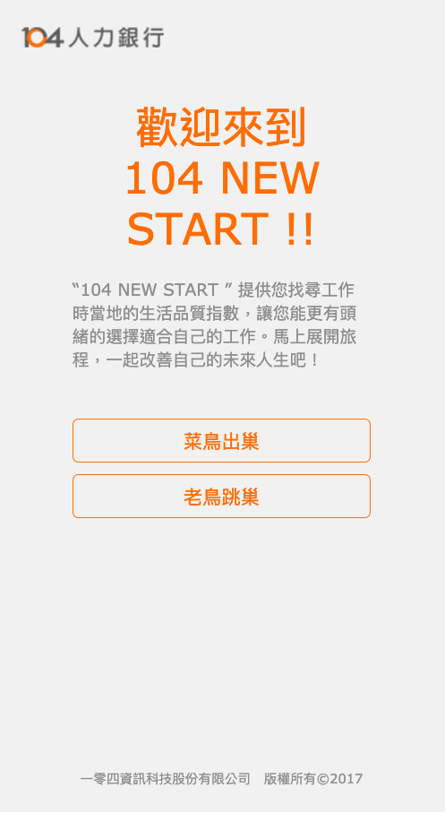
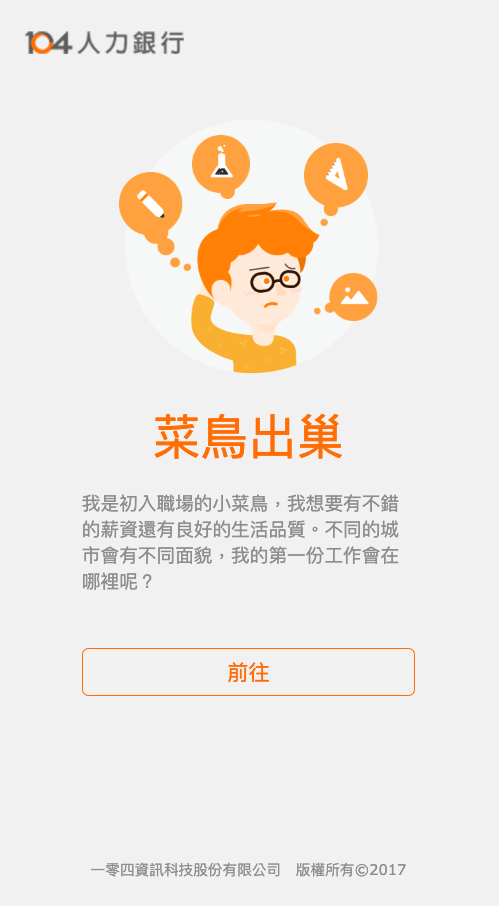
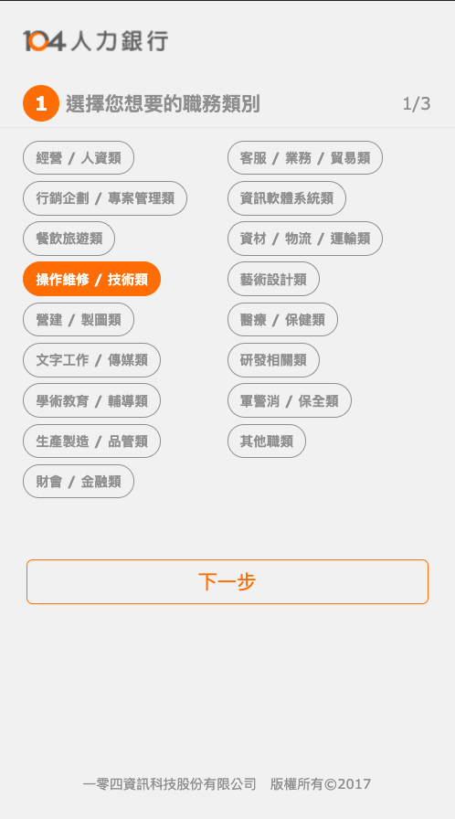
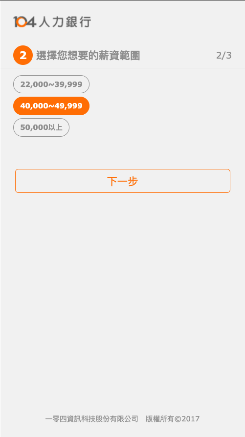
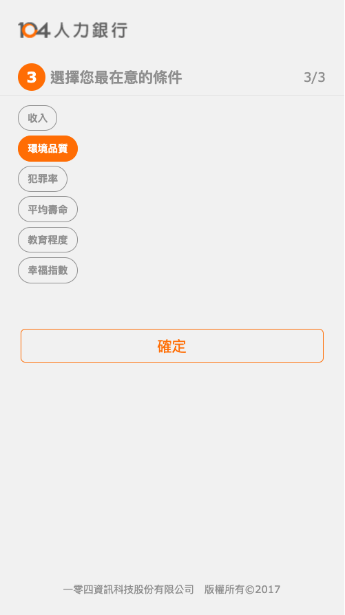
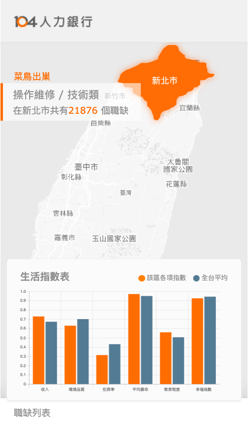
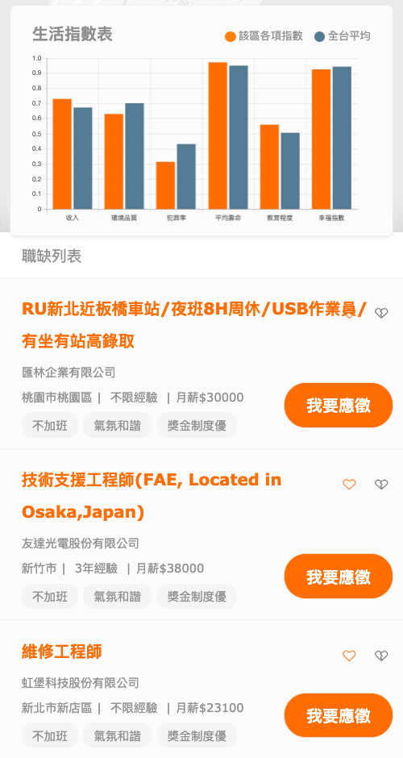

# 104 New Start
#### 104 hackathon demo
#### project name: m1ga

* Team Members:
    * Mou.Wang (Backend/DevOps)
    * Tim.Chen (Frontend Design)
    * Mooncake Shu (UI/UX)
    * Andy (Design)
---

* project display via Docker
* pre-req: 
    * `Docker` Environment
    * `Makefile` support
    
* Install Steps:
    * `git clone`
    * `make build` - Build Docker Environment
    * `make start` - Launch the app
    * visit via `localhost:9090`
    * `make stop` - Stop the app
    * you need to manually remove docker images
----

* Screenshot

---
